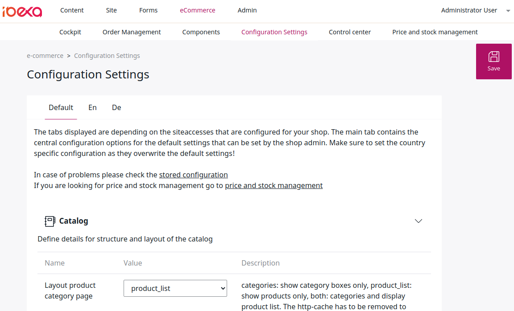

# Shop configuration

To change configuration settings for the shop, go to **eCommerce** > **Configuration settings**.

For some of the setting, you can configure them differently for different SiteAccesses.

!!! caution

    Settings defined in the Back Office always override the configuration in YAML files.

## Catalog

|Name|Description|
|--- |--- |
|Layout product category page|Layout for the product category page. `category` - show category boxes only `product_list` - show products only `both` - show both categories and products.|
|Last viewed product limit|The maximum number of last viewed products to store (per user).|
|Product description character limit|Number of characters from the Subtitle Field that are visible as description in the list views and search results.|

## Price

|Name|Description|
|--- |--- |
|Automatic currency conversion|When enabled, calculates the price using the configured conversion rate if no price is set up for the current currency.|
|Currency conversion rate|The conversion rate between currencies.|
|Default currency|Used as a fallback when SiteAccess-specific currency is not set.|
|Base currency|Base currency of the shop, used for the Fields "Product unit price" and "Fallback shipping price". The base currency is used for the automatic currency conversion.|
|Price providers|Price engines used for generating price and stock information in different parts of the shop. This configuration works as a chain, so if the first engine fails, the second one is used (e.g. if ERP is not available).|

## Advanced catalog features 

|Name|Description|
|--- |--- |
|User interface for ordering variants|User interface used for ordering variants on the product detail page. `B2B` is optimized for ordering more than one product at once. `B2C` enables ordering for one product only, but is more user friendly.

## ERP

[ERP integration](erp_integration/erp_integration.md) requires a Web.Connector license or another webservice interface between ERP and the shop.

|Name|Description|
|--- |--- |
|Default Country for Template Debitor|Country used as a default.|
|Login with Customer Number|When enabled, the login process includes a field for providing the customer number.|
|Use a template debitor number for this shop|When enabled, a template debitor customer number is used if a customer does not have a customer number from the ERP. Template debitor customer numbers can be defined for each country.|
|Use a template contact number for this shop|When enabled, a template contact number is used if a customer does not have a customer and contact number from the ERP. Template contact numbers can be defined for each country.|
|Price requests without customer number|When enabled, a price request is sent to the ERP without customer number. A template debitor is used to calculate prices.|
|Recalculate prices using the ERP after (seconds)|How long information from the ERP is cached to reduce the traffic towards the ERP. Use a "1 hour" syntax.|
|Variants handling in the ERP|Handling of variant products. Use: SKU_ONLY if the ERP system uses different SKUs per variant.  SKU_AND_VARIANT if the ERP system uses a combination of SKU and variant code for variants.|
|URL of the Web-Connector|The URL points to the Web.Connector installed by the ERP system. Use an HTTPS connection and make sure that the shop can access this IP and port only.|
|User name (configured per Web-Connector)|User name for communication with the Web.Connector service.|
|Password (configured per Web-Connector)|Password for communication with the Web.Connector service.|
|SOAP Web-Service timeout in seconds|Timeout (web service) for communication with the Web.Connector in seconds.|
|Timeout towards the ERP-System in seconds|Timeout (ERP) for communication with the Web.Connector in seconds.|

## Fallback configuration for price engine

This fallback configuration is used if no shipping costs are set in price and stock management.

|Name|Description|
|--- |--- |
|Fallback costs for shipping|Shipping cost used when the free shipping limit is not reached.|
|Fallback VAT Code for shipping costs|VAT code for shipping.|

## Basket

|Name|Description|
|--- |--- |
|Duration of storing anonymous baskets|How long anonymous baskets are stored (in hours).|
|Update product data after this time|How long  product data is cached in the basket. Use a "1 hour" syntax.|

## Stored basket

|Name|Description|
|--- |--- |
|Display stock as a column|When enabled, stock information is displayed in column, otherwise, it is displayed inline (inside product name column).|
|Description character limit|Number of characters from the Subtitle Field that are visible as description.|

## Wishlist

|Name|Description|
|--- |--- |
|Description character limit|Number of characters from the Subtitle Field that are visible as description.|

## Miscellaneous

|Name|Description|
|--- |--- |
|Number of bestsellers displayed on bestseller page|The limit of bestselling items displayed on the bestseller page.|
|Number of bestsellers displayed on catalog pages|The limit of bestselling items displayed on catalog pages.|
|Number of bestsellers displayed in a slider|The limit of bestselling items displayed in a slider.|
|Bestseller threshold|How often a product has to be bought to count as a bestseller.|

## Checkout

|Name|Description|
|--- |--- |
|Payment method PayPal|Enables PayPal in checkout.|
|Payment method "invoice"|Enables invoice in checkout.|
|Shipping method "standard"|Enables the standard shipping method in checkout.|
|Shipping method "express"|Enables the express shipping method in checkout.|
